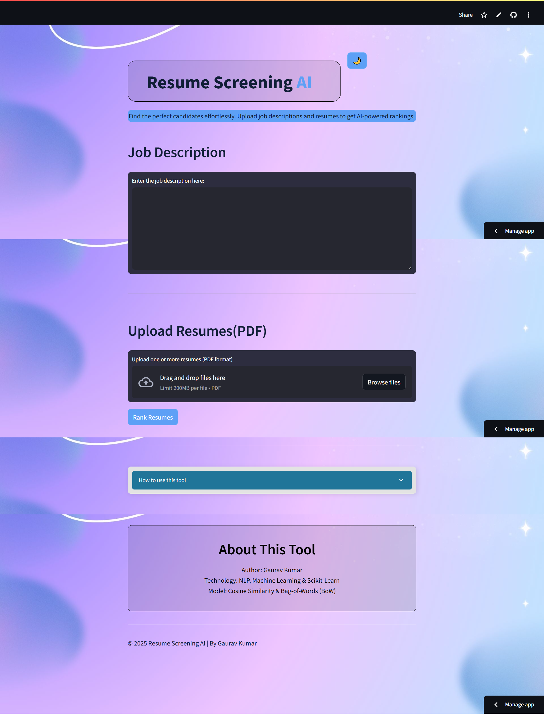
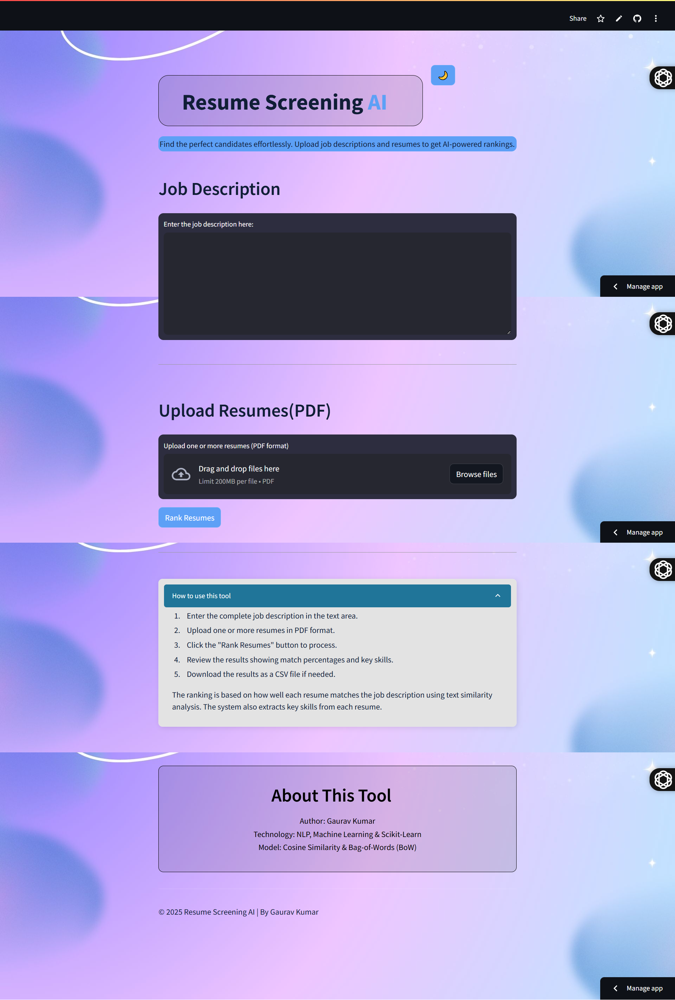
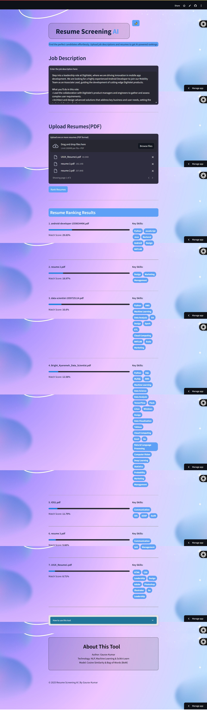

# 📄 AI-Powered Resume Screening & Ranking System

## 🚀 Overview
This project is an **AI-powered Resume Screening System** built using **Python** and **Streamlit**. It helps HR professionals and recruiters efficiently screen resumes by matching them with job descriptions using **NLP and Machine Learning techniques**.

## 🎯 Objective
- Automate the resume screening process.
- Match resumes with job descriptions using **cosine similarity**.
- Extract key skills from resumes.
- Provide a user-friendly interface for recruiters to analyze results.

## ✨ Features
- 🔹 **Upload PDF Resumes** – Supports bulk uploads
- 🔹 **Job Description Matching** – Uses **NLP** to match resumes with job roles
- 🔹 **Skill Extraction** – Identifies relevant **technical skills** from resumes
- 🔹 **Similarity Scoring** – Ranks resumes based on **cosine similarity**
- 🔹 **Interactive UI** – Built with **Streamlit** for seamless user experience
- 🔹 **Dark & Light Mode Support** – Custom theming for better readability

## 🛠️ Tech Stack
- **Python** 🐍
- **Streamlit** 📊 (Frontend)
- **NLTK & Scikit-learn** 🧠 (NLP & ML)
- **PyPDF2** 📄 (PDF Parsing)

## 📸 Screenshots
### 🔹 Home Page in Light Mode


### 🔹 Home Page in Dark Mode


### 🔹 Expandible Instruction


### 🔹 Resume Upload & Analysis


### 🔹 Result & Ranking in Light Mode


## 🚀 Installation & Setup
```bash
# Clone the repository
git clone https://github.com/gauravkumarsony/Resume-Ranking-AI.git

# Navigate to project directory
cd Resume-Ranking-AI

# Create virtual environment
python -m venv env
source env/bin/activate  # On Windows: env\Scripts\activate

# Install dependencies
pip install -r requirements.txt

# Run the Streamlit app
streamlit run app.py
```

## 📌 Usage
1. Upload multiple **PDF resumes**.
2. Enter the **Job Description**.
3. Click on **Analyze**.
4. View ranked resumes based on similarity score.
5. Download the analyzed report (coming soon 🚀).

## 🤝 Contributing
Want to improve this project? Contributions are welcome! 🙌

1. Fork the repository 🍴
2. Create a new branch (`git checkout -b feature-branch`)
3. Commit your changes (`git commit -m "Added new feature"`)
4. Push to your branch (`git push origin feature-branch`)
5. Open a **Pull Request** 🚀

## ⭐ Support the Project!
If you find this project helpful, please consider **giving it a star ⭐** and **forking the repo 🍴**.

[](https://github.com/gauravkumarsony/Resume-Ranking-AI.git)

🔔 **Follow me on GitHub** for more exciting projects! [Gaurav Kumar](https://github.com/gauravkumarsony) 💙
